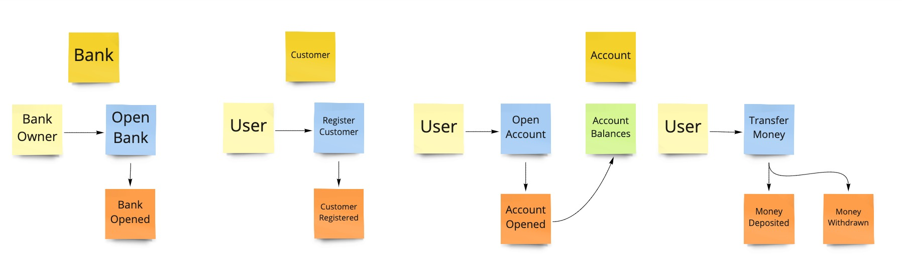

A DDD model for a simplified bank domain.

The code has been built using the Python 3.8 standard library.  There are no extra dependencies.

**To run the tests:** `python3 -m unittest`

### Process 
I did a brief event storming session to try an tease out the commands, aggregates and views:

The three main aggregates are *Bank, Customer and Account*. 

My interpretation of the requirements is that a single customer belongs to one bank, but that customer can have multiple accounts.  Hence the different Bank, Customer and Account balances.

### Design

The code follows a simplified Command/Query structure.  Domain events are used for side effects.

### Constraints
- Maximum deposit value is $10^6
- Maximum account balance is $10^8

### Testing
Rather than unit testing every class I created integration tests to exercise end-to-end scenarios.

### Additional thoughts
Some elements of a banking app that are beyond scope:
- **Consistency**: One of the most important aspects of a banking system is that account balances are consistent.  Every operation typically requires at least two updates: one to debit the source and another to credit the destination account. If a process dies after the debit the system could be left in an inconsistent state.
- **Resiliency**: Operations to transfer money may succeed, but the response to the client could fail due to network issues.  The client could be lead to believe the transfer did *not* succeed and retry, leading to duplicate transfers.
- **Durability**: What happens if the database containing all the account details fails?  Would the bank lose everyone's money?
- **Scalability**: Most banks need to scale to many millions of users that a single database may not be able to handle.

High-level solutions to some of these problems:
- **Database Transactions/Sagas/Outbox Pattern**: these are all approaches either to ensure a single or distributed transaction completes in full or rolls back.
- **Idempotency**: every operation should be idempotent and be able to be repeated without creating duplication within the system.
- **Data Replication**: databases need to be replicated across availability zones and regions to ensure failures don't result in data loss
- **Sharding**: sharding customers and accounts ensure load can be distributed across resources
